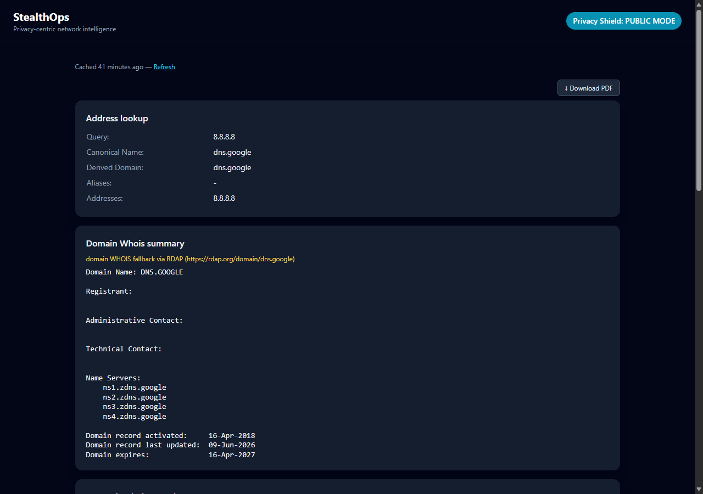
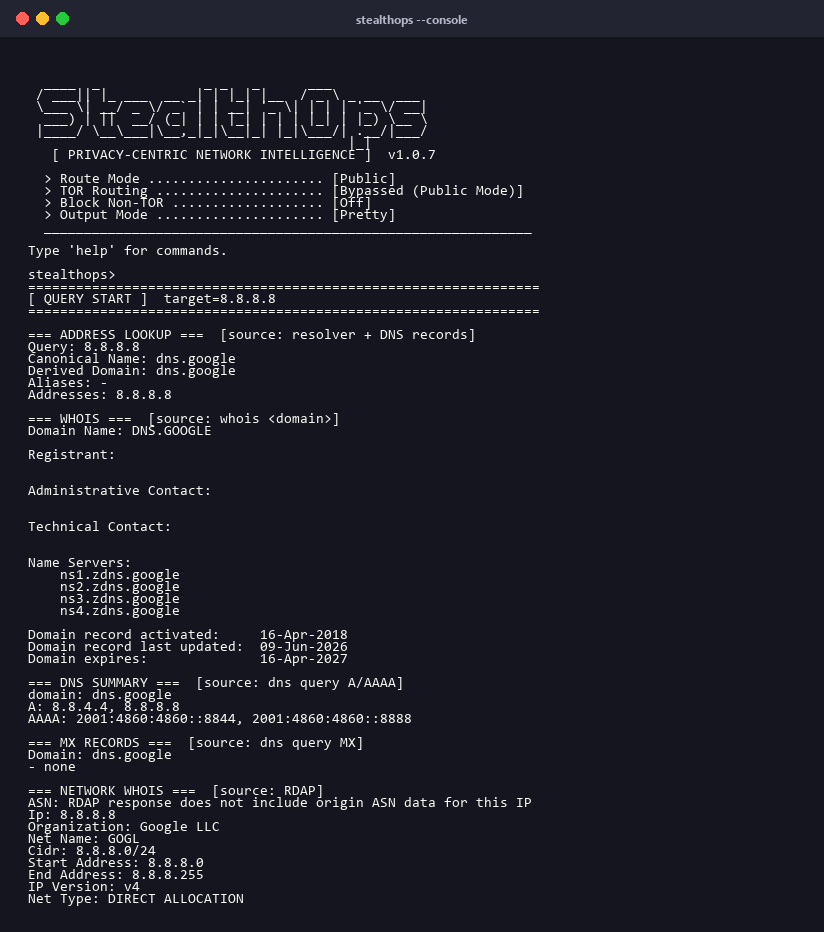
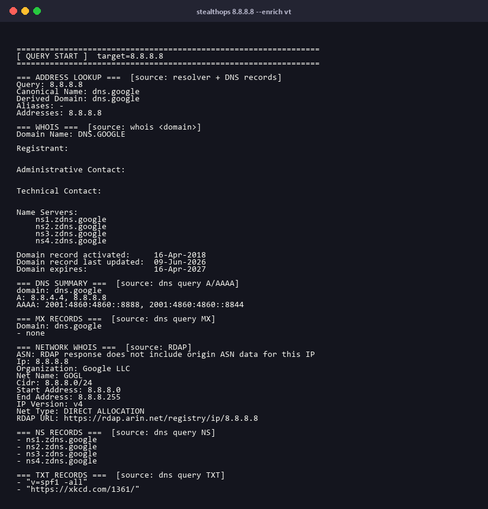
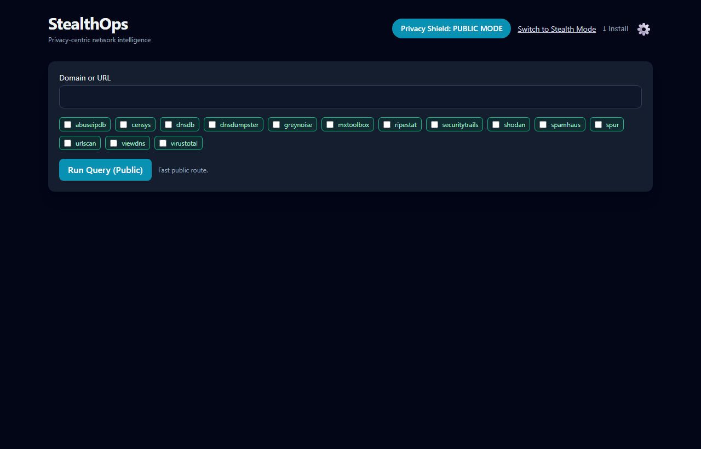

# StealthOps

Privacy-hardened OSINT and network reconnaissance. DNS, WHOIS, MX records, HTTP headers, and 14 threat-intel enrichment providers — with optional Tor routing for operational security.



---

## Install

**Windows** (PowerShell — no admin required):

```powershell
irm https://github.com/presack/StealthOps/releases/latest/download/install.ps1 | iex
```

Installs to `%LOCALAPPDATA%\Programs\StealthOps\`, adds to PATH, and configures the Linux binary in WSL2 automatically. Windows and WSL2 share the same API key store.

**Linux** (x86_64):

```bash
curl -fsSL https://github.com/presack/StealthOps/releases/latest/download/install.sh | bash
```

Installs to `~/.local/bin/`, SHA256-verified.

After installing, open a new terminal and run:

```
stealthops --console
```

To configure API keys for enrichment providers:

```
stealthops --configure-keys
```

---

## Three interfaces

### Console — interactive mode (primary)

The console is the primary workflow. It keeps session state, supports tab-like enrichment shortcuts, and accepts direct target input without any prefix.



```
stealthops --console
```

Key commands:

```
# Query
8.8.8.8                       look up a target (any IP, domain, or URL)
last / reload / full          recall / re-fetch (bypass cache) / expand last result

# Enrichment
enrich all                    persistent mode: run all providers on every query
all                           run all providers now on the last target
vt / shodan / cs / ab ...     run a single provider (uses last target if omitted)
providers                     provider status, keys, aliases, and session usage

# Keys
set-key                       interactive API key setup wizard
set-key virustotal <key>      set a key directly

# Routing
mode stealth                  route through Tor
mode public                   direct route

# Other
help                          grouped command reference
web                           launch web server in background
```

---

### CLI — single-shot queries

```
stealthops 8.8.8.8
stealthops example.com --enrich all
stealthops example.com --mode stealth
stealthops 8.8.8.8 --enrich vt,shodan --json
stealthops --web
stealthops --providers
stealthops --update
```



---

### Web dashboard

```
stealthops --web
```

Opens at `http://127.0.0.1:5000`. Select enrichment providers via checkboxes, toggle stealth mode, and download PDF reports — all from the browser. Includes a Settings page (⚙ icon) for managing API keys without touching the command line.



---

## Enrichment providers

14 providers. Run `stealthops --configure-keys` to enter keys interactively, or use `set-key` in console mode.

| Provider | Alias | Targets |
|---|---|---|
| VirusTotal | `vt` | IP · Domain · URL |
| ViewDNS | `vd` | IP · Domain · URL |
| MXToolbox | `mx` | IP · Domain · URL |
| DNSDB | `ddb` | IP · Domain · URL |
| urlscan.io | `us` | IP · Domain · URL |
| Shodan | — | IP · ASN |
| Censys | `cs` | IP · ASN |
| GreyNoise | `gn` | IP · ASN |
| Spur | — | IP |
| AbuseIPDB | `ab` | IP |
| DNSDumpster | `dd` | Domain · URL |
| SecurityTrails | `st` | Domain · URL |
| Spamhaus ASN-DROP | — | ASN |
| RIPEstat | `rs` | ASN |

Keys are stored in `%LOCALAPPDATA%\StealthOps\keys.env` (Windows) or `~/.config/stealthops/keys.env` (Linux). Environment variables take precedence if set.

---

## Stealth mode (Tor)

In stealth mode, all queries are routed through Tor and DNS is resolved via DNS-over-HTTPS through the Tor SOCKS5 proxy — no direct connections from your host.

```
stealthops --install-tor          # install managed Tor runtime
stealthops example.com --mode stealth
stealthops --console              # then: mode stealth
```

Tor discovery order: `TOR_PATH` env var → managed runtime → bundled → system PATH.

---

## Advanced

### Deployment modes

| Mode | How to activate | Auth | API keys |
|---|---|---|---|
| **Personal** | default | none | `--configure-keys` or env vars |
| **Server** | `SERVER_MODE=1` | form login | per-user, encrypted in SQLite |
| **Training** | `TRAINING_MODE=1` | HTTP Basic Auth | env vars, shared |

### Server mode

Multi-user web deployment with per-user encrypted API key storage. Users log in and manage their own keys via the web Settings page.

```bash
python main.py --generate-fernet-key          # generate encryption key (once)
python main.py --create-user alice
SERVER_MODE=1 FERNET_KEY=<key> python main.py --web
```

Admin key management:

```bash
python main.py --set-key virustotal <key> --all-users
python main.py --copy-keys alice bob
python main.py --list-users
```

### Training mode

For shared workshop deployments. Enables HTTP Basic Auth, 24-hour result cache, elevated rate limits, and runs all available providers on every query (provider selection is hidden from participants).

```bash
TRAINING_MODE=1 TRAINING_AUTH_USER=stealthops TRAINING_AUTH_PASS=<passphrase> python main.py --web
```

### Cloud / Docker deployment

The `deploy/` directory contains scripts for three platforms:

| Script | Platform | Purpose |
|---|---|---|
| `deploy/create-vm.sh` | GCP | Provision an e2-small VM, open firewall, print IP |
| `deploy/vm-setup.sh` | Any VM | Install Docker + nginx, issue Let's Encrypt cert, start container |
| `deploy/azure.sh` | Azure | Deploy to Azure Container Apps |
| `deploy/gcp.sh` | GCP | Deploy to Cloud Run (serverless, legacy) |

**VM approach** (recommended for training events — works on GCP, Azure, AWS, or any Linux VM):

```bash
# GCP — provision VM from Cloud Shell
bash deploy/create-vm.sh <name> stealthops-prod <zone>

# Azure / AWS — provision a Linux VM manually, then SSH in and run:
bash deploy/vm-setup.sh <subdomain.yourdomain.com> <email>

# Redeploy after a code change
git pull && sudo docker compose build --no-cache && sudo docker compose up -d
```

`vm-setup.sh` is cloud-agnostic — it only needs a Linux VM with a public IP and ports 80/443 open. `create-vm.sh` is the GCP-specific provisioning step.

**Azure Container Apps:**

```bash
bash deploy/azure.sh <resource-group> [location] [app-name] [env-name]
# e.g.: bash deploy/azure.sh rg-stealthops eastus stealthops stealthops-env
```

---

## Build from source

Requires Python 3.12:

```powershell
py -3.12 -m venv .venv
.\.venv\Scripts\Activate.ps1
pip install -r requirements.txt
python main.py --console
```

Build standalone binaries:

```powershell
.\scripts\build.ps1              # Windows EXE → dist\windows\stealthops.exe
bash ./scripts/build-linux.sh    # Linux binary → dist/linux/stealthops (run in WSL2)
.\scripts\release.ps1 v1.2.3     # Stamp version, build both, publish GitHub release
```

---

## License

MIT
